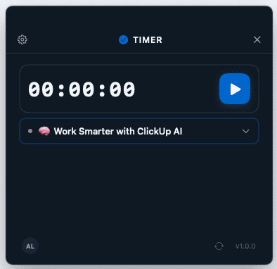
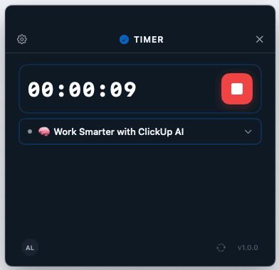
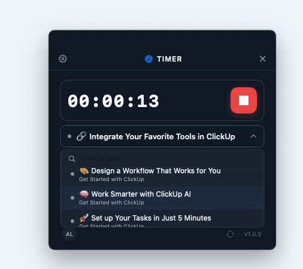

# ChronoTask

A lightweight, always-on-top macOS app for tracking time directly to [ClickUp](https://clickup.com) tasks. Built with Swift and SwiftUI.

<p align="center">
  
  
</p>
<p align="center">
  
</p>

## What It Does

ChronoTask is a floating mini-window that sits on top of all your other windows. Select a ClickUp task, hit play, and when you stop the timer it automatically creates a time entry in ClickUp with the exact duration.

- **Floating window** — always visible, never buried behind other apps
- **Task search** — filterable dropdown with all your assigned tasks
- **One-click tracking** — play/stop to start and sync time entries
- **Keyboard shortcuts** — Space or Enter to toggle the timer
- **Secure** — API token stored in macOS Keychain, never in plaintext
- **Offline-safe** — automatic retry with exponential backoff on network errors

## Requirements

- macOS 13.0 (Ventura) or later
- [Xcode](https://developer.apple.com/xcode/) 15+ (with Command Line Tools)
- [XcodeGen](https://github.com/yonaskolb/XcodeGen)
- A ClickUp account with a [personal API token](https://clickup.com/api/developer-tools/personal-token/)

## Installation

### 1. Install dependencies

```bash
brew install xcodegen
```

Make sure Xcode Command Line Tools point to Xcode (not just CommandLineTools):

```bash
sudo xcode-select -s /Applications/Xcode.app/Contents/Developer
```

### 2. Clone and build

```bash
git clone https://github.com/your-username/ChronoTask.git
cd ChronoTask
xcodegen generate
xcodebuild -scheme ChronoTask -configuration Debug build \
  SYMROOT=./Build \
  CODE_SIGN_IDENTITY="-" \
  CODE_SIGNING_REQUIRED=NO \
  CODE_SIGNING_ALLOWED=NO
```

### 3. Run

```bash
open Build/Debug/ChronoTask.app
```

## Usage

1. **Enter your ClickUp API token** — Get it from [ClickUp Settings > Apps](https://app.clickup.com/settings/apps)
2. **Select your workspace** — Auto-selected if you only have one
3. **Pick a task** from the dropdown (type to search)
4. **Press play** to start tracking time
5. **Press stop** when done — the time entry is synced to ClickUp automatically

### Keyboard Shortcuts

| Key | Action |
|-----|--------|
| `Space` | Toggle play/stop |
| `Enter` | Toggle play/stop |
| `Arrow keys` | Navigate task list |

## Running Tests

```bash
xcodegen generate
xcodebuild -scheme ChronoTask -configuration Debug test \
  SYMROOT=./Build \
  CODE_SIGN_IDENTITY="-" \
  CODE_SIGNING_REQUIRED=NO \
  CODE_SIGNING_ALLOWED=NO
```

## Project Structure

```
ChronoTask/
├── App/
│   ├── ChronoTaskApp.swift         # Entry point
│   └── AppDelegate.swift           # Floating window setup
├── Models/
│   ├── ClickUpModels.swift         # API response types
│   └── AppState.swift              # Auth state management
├── Services/
│   ├── ClickUpAPI.swift            # ClickUp API v2 client
│   ├── KeychainService.swift       # Secure token storage
│   └── TimerManager.swift          # Timer state machine
├── Utilities/
│   ├── Theme.swift                 # Colors, fonts, spacing
│   ├── Extensions.swift            # Helpers (Color hex, time formatting)
│   └── FloatingWindow.swift        # NSWindow subclass (always-on-top)
└── Views/
    ├── ContentRouter.swift         # Auth routing
    ├── SetupView.swift             # Token input screen
    ├── MainView.swift              # Timer + task UI
    └── Components/
        ├── TaskSelector.swift      # Searchable task dropdown
        ├── TimerDisplay.swift      # HH:MM:SS display
        ├── PlayStopButton.swift    # Play/stop toggle
        └── ToastView.swift         # Success/error notifications
```

## Tech Stack

- **Swift 5.9** + **SwiftUI** (with AppKit for window management)
- **XcodeGen** for project generation (no `.xcodeproj` in repo)
- **ClickUp API v2** for tasks and time entries
- **macOS Keychain** (Security.framework) for token storage
- Target: **macOS 13.0+** (Ventura)

## License

MIT
