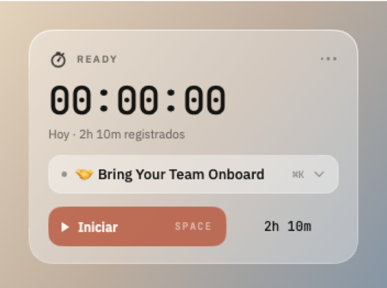
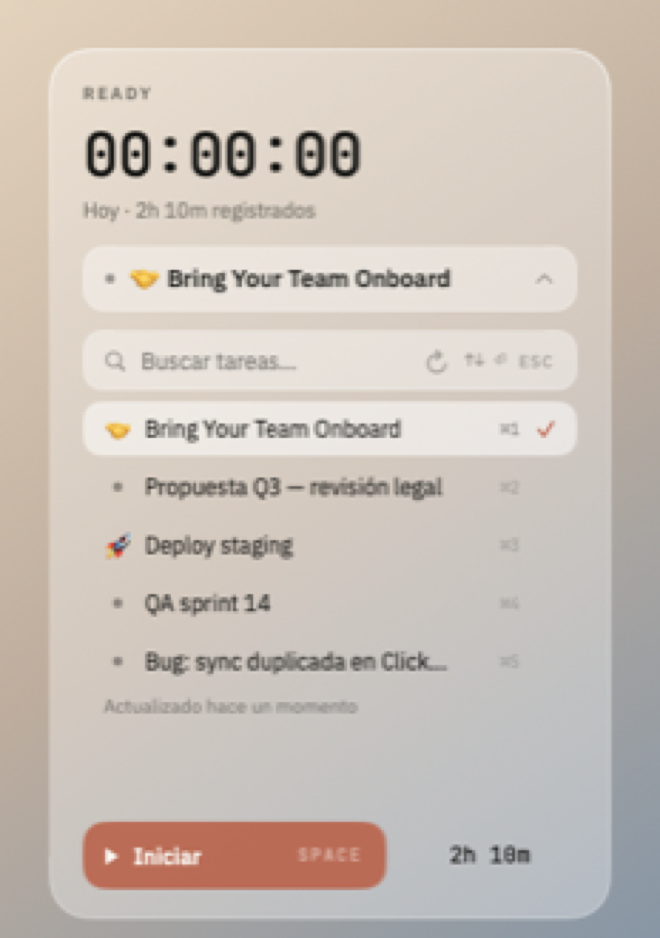
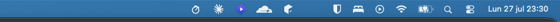

# ChronoTask

A macOS menu bar app for tracking time straight into [ClickUp](https://clickup.com) tasks, built to be driven entirely from the keyboard.

<p align="center">
  
  
</p>

## What It Does

Click the stopwatch in the menu bar — or hit <kbd>⌥⌘T</kbd> from anywhere — and a translucent panel drops down under it. Pick a task, start the timer, and when you stop it the time entry lands in ClickUp with the exact duration.

<p align="center">
  
</p>

- **Lives in the menu bar.** No window in your way. While tracking, the elapsed time shows next to the icon.
- **Hover peek.** Point at the icon and a small panel appears with the timer and a stop button — no need to open anything.
- **Keyboard first.** Open, search, pick and start without touching the mouse. See [Keyboard](#keyboard).
- **Today's total, from ClickUp.** `Hoy · 2h 10m registrados` is read from the API, so it also counts time logged from the web or your phone.
- **Follows your appearance.** Light and dark, automatically.
- **Your token stays in the Keychain.** Never on disk in the clear.
- **Hard to lose time.** A running session survives an unexpected quit, and entries that fail to upload are queued and retried.

## Install

ChronoTask is not on the App Store and is not notarised, so the installer signs it locally (*ad-hoc*) and clears the quarantine flag. That is all Gatekeeper needs — **no Apple Developer account, no security warnings to click through**.

```bash
git clone https://github.com/your-username/ChronoTask.git
cd ChronoTask
./install.sh --run
```

That builds the app, installs it into `/Applications` and launches it.

| Option | What it does |
|---|---|
| `./install.sh` | Build and install into `/Applications` |
| `./install.sh --run` | …and launch it when done |
| `./install.sh --login` | …and start it automatically at login |
| `./install.sh --dev` | Install into `./Build` instead, leaving `/Applications` alone |
| `./install.sh --uninstall` | Remove the app and the login item |

**Requirements.** macOS 13 (Ventura) or later, and nothing else. The installer uses full Xcode if it happens to be selected, and otherwise falls back to the Swift compiler in the Command Line Tools; both paths produce the same app, icon included. For the Xcode path you also need [XcodeGen](https://github.com/yonaskolb/XcodeGen) (`brew install xcodegen`), because the `.xcodeproj` is generated rather than committed.

To use full Xcode if you have it installed:

```bash
sudo xcode-select -s /Applications/Xcode.app/Contents/Developer
```

## Setup

1. Get a personal API token from [ClickUp → Settings → Apps](https://app.clickup.com/settings/apps).
2. Open ChronoTask and paste it in.
3. Pick a workspace — skipped automatically if you only have one.

## Keyboard

The whole flow without the mouse: <kbd>⌥⌘T</kbd> → type a couple of letters → <kbd>⏎</kbd> → <kbd>Space</kbd>. Or shorter still, <kbd>⌥⌘T</kbd> → <kbd>⌘2</kbd>.

### Anywhere

| Key | Action |
|---|---|
| <kbd>⌥⌘T</kbd> | Open or close the panel, from any app |

### In the panel

| Key | Action |
|---|---|
| <kbd>Space</kbd> | Start / stop the timer |
| <kbd>↓</kbd> | Expand the task list |
| <kbd>⌘K</kbd> · <kbd>⌘F</kbd> · <kbd>/</kbd> | Jump to the task search field |
| <kbd>⌘1</kbd>…<kbd>⌘9</kbd> | Pick that task **and start the timer** |
| <kbd>Esc</kbd> | Close the panel |

### In the task list

| Key | Action |
|---|---|
| <kbd>↑</kbd> <kbd>↓</kbd> | Move through the tasks, scrolling as needed |
| <kbd>⏎</kbd> | Select the focused task |
| <kbd>Esc</kbd> | Close the list — press again to close the panel |
| *(type)* | Filter by name |

The list is cached for five minutes and reloaded when it goes stale. The refresh button in the search field forces it sooner and spins while it works; underneath, *Actualizado hace X min* tells you how old what you are looking at is. Until the list has ever loaded that line stays empty rather than claiming a freshness the app cannot back.

<kbd>Space</kbd> is left alone while you are typing in the search field, so you can search for "Deploy staging" without stopping the timer.

### In the menu bar's context menu

Right-click the icon for: open the panel, start/stop, refresh tasks (<kbd>⌘R</kbd>), change the API key, and quit (<kbd>⌘Q</kbd>).

## How It Works

Some behaviour worth knowing about, because it is deliberate:

- **Today's total is whatever ClickUp says**, plus the session currently running. It is not a local tally, so a failed sync never inflates it. If the figure has never loaded, a dash is shown rather than `0m` — that would be a claim the app cannot back.
- **A session that crosses midnight counts towards the day it started**, matching how ClickUp files it. So the total does not drop when the entry is finally posted.
- **If the app quits while timing**, the session is recovered on next launch. Reopened within a couple of minutes it just resumes; after longer it asks, and only ever offers the stretch up to the last heartbeat — never the gap where your Mac may have been asleep.
- **If an upload fails**, the entry is written to disk and retried on launch, after each successful sync, and every minute while anything is pending. The time is not lost.
- **Switching task while the timer runs** stops it, waits for the entry to actually reach ClickUp, and then starts the new one.

## Development

```bash
xcodegen generate     # regenerate the project after adding files
xcodebuild -scheme ChronoTask -configuration Debug build \
  SYMROOT=./Build CODE_SIGN_IDENTITY="-" \
  CODE_SIGNING_REQUIRED=NO CODE_SIGNING_ALLOWED=NO
```

Tests (these need full Xcode, since `XCTest` does not ship with the Command Line Tools):

```bash
xcodebuild -scheme ChronoTask test SYMROOT=./Build \
  CODE_SIGN_IDENTITY="-" CODE_SIGNING_REQUIRED=NO CODE_SIGNING_ALLOWED=NO
```

Handy while working on the UI — launch with the panel already open:

```bash
CHRONOTASK_SHOW_PANEL=1     open -a ChronoTask   # panel open
CHRONOTASK_SHOW_PANEL=list  open -a ChronoTask   # panel open, task list expanded
```

### Project Structure

```
ChronoTask/
├── App/
│   ├── ChronoTaskApp.swift            # Entry point
│   ├── AppDelegate.swift              # Launch
│   ├── AppEnvironment.swift           # Composition root: builds and wires services
│   └── MenuBar/
│       ├── MenuBarCoordinator.swift   # Glues status item, panel and peek to state
│       ├── StatusItemController.swift # Icon, clock, left/right click, hover
│       ├── MainPanelController.swift  # Position, size and dismissal of the panel
│       └── PeekController.swift       # Hover peek window
├── Models/
│   ├── ClickUpModels.swift            # API response types
│   ├── TaskEligibility.swift          # Which tasks may be tracked
│   └── AppState.swift                 # Auth state
├── Services/
│   ├── ClickUpAPI.swift               # ClickUp API v2 client
│   ├── ClickUpAPIClient.swift         # Protocol seam for testing
│   ├── KeychainService.swift          # Token storage
│   ├── TimerManager.swift             # Timer state machine + session persistence
│   ├── TaskStore.swift                # Task list cache and selection
│   ├── DailyTotalService.swift        # Today's total, read from ClickUp
│   ├── DailyTotalCalculator.swift     # Pure day-total arithmetic
│   ├── SessionStore.swift             # Crash recovery for a running session
│   ├── PendingEntryQueue.swift        # Retry queue for failed uploads
│   └── AppPreferences.swift           # Small non-secret preferences
├── Utilities/
│   ├── Theme.swift                    # Design tokens, light/dark aware
│   ├── Surfaces.swift                 # Glass and inset surface modifiers
│   ├── GlassPanel.swift               # Translucent NSPanel + visual effect view
│   ├── StatusItemIcon.swift           # The menu bar mark, drawn in code
│   ├── SyncLabel.swift                # "Actualizado hace X min" wording
│   ├── GlobalHotKey.swift             # ⌥⌘T, via Carbon (no Accessibility prompt)
│   ├── StatusItemAnchor.swift         # Panel positioning geometry
│   ├── ContentSizingHostingController.swift  # Content-driven window height
│   ├── ClickUpTask+Display.swift      # Row presentation helpers
│   ├── Notifications.swift            # Shared notification names
│   └── Extensions.swift               # Colour hex, time formatting
├── ViewModels/
│   └── MainViewModel.swift            # Panel presentation state
└── Views/
    ├── ContentRouter.swift            # Auth routing
    ├── SetupView.swift                # Token entry
    ├── MainView.swift                 # Panel layout and keyboard handling
    └── Components/                    # StatusPill, TimerDisplay, TaskListPanel, …
```

### Tech Stack

- **Swift 5.9** and **SwiftUI**, with AppKit for the menu bar, the panel and the global hot key
- **XcodeGen** for project generation — no `.xcodeproj` in the repo
- **ClickUp API v2** for tasks and time entries
- **macOS Keychain** for the token
- Target: **macOS 13.0+**

## Troubleshooting

**«ChronoTask can't be opened because Apple cannot check it».** Run `./install.sh` again; it clears the quarantine flag. To do it by hand: `xattr -dr com.apple.quarantine /Applications/ChronoTask.app`.

**<kbd>⌥⌘T</kbd> does nothing.** Another app has claimed it. The shortcut is defined in `GlobalHotKey.Combo.togglePanel`.

**The icon is missing from the menu bar.** With many icons, macOS hides the ones that do not fit — more so on notched displays. ChronoTask still works; <kbd>⌥⌘T</kbd> opens the panel, which then falls back to the top-right corner of the screen.

**macOS keeps asking for Keychain access.** Rebuilding produces a new ad-hoc signature, which macOS treats as a different app. Installing over the same path with `./install.sh` keeps it stable.

## License

MIT
